# MOVIXA — Movies. Moods. Moments.
**Interactive Movie Recommendation & Sentiment Intelligence Platform**  
*Department of Artificial Intelligence & Machine Learning (AI&ML), TCET*

---

## 1. Project Overview & Problem Definition

In modern media streaming platforms, users face choice overload when searching for content and navigating reviews. This project delivers an integrated, two-tier machine learning web application that combines:

1. **Unsupervised Content-Based Movie Recommendation:**
   - Groups 4,800+ movies into semantic thematic clusters using **TF-IDF + TruncatedSVD (Dimensionality Reduction) + K-Means Clustering**.
   - Generates ranked similar movie recommendations using a hybrid score of cosine similarity within the cluster subspace and community rating (`vote_average`).

2. **Supervised Review Sentiment Analysis:**
   - Classifies user reviews as **Positive** or **Negative** with calibrated confidence probabilities.
   - Built with **TF-IDF n-gram vectorization** and hyperparameter-tuned **Logistic Regression** (selected as champion over LinearSVC and Multinomial Naive Bayes via 3-fold cross-validation `GridSearchCV`).

3. **Production Web Architecture:**
   - Decoupled **Flask REST API** backend with modular routing blueprints and service layers.
   - High-performance, cinematic modern frontend (dark mode, glassmorphism, responsive grid, live sentiment tester, and review submission).

---

## 2. System Architecture

```mermaid
graph TD
    subgraph Client ["Frontend Client (Vanilla HTML/CSS/JS)"]
        UI_Search["Movie Catalog & Live Search"]
        UI_Modal["Detail & Cluster Recommendations"]
        UI_Sentiment["Live Sentiment Testing Studio"]
        UI_Review["Submit & Score Movie Review"]
    end

    subgraph Backend ["Flask REST API (/api/*)"]
        Router["Flask App Entrypoint (app.py)"]
        RecRoute["routes/recommend.py"]
        SentRoute["routes/sentiment.py"]
        RecService["services/recommender.py"]
        SentService["services/sentiment_service.py"]
        Preproc["utils/preprocessing.py"]
    end

    subgraph Models ["Persisted ML Models (models/)"]
        KMeansModel["cluster_model.pkl (k=15)"]
        SVDModel["svd.pkl (50 dims)"]
        ScalerModel["scaler.pkl (StandardScaler)"]
        TfidfModel["tfidf_vectorizer.pkl"]
        ClassifierModel["sentiment_model.pkl (Logistic Reg)"]
        MetricsLog["metrics_log.csv"]
    end

    subgraph Data ["Data Stores (data/)"]
        RawTMDB["data/raw/tmdb_5000_movies.csv"]
        RawIMDB["data/raw/imdb_reviews.csv"]
        ProcMovies["data/processed/movies_clean.csv"]
        ProcReviews["data/processed/reviews_clean.csv"]
        UserReviews["data/processed/user_reviews.json"]
    end

    UI_Search -->|GET /api/movies| RecRoute
    UI_Modal -->|GET /api/recommend/:id| RecRoute
    UI_Sentiment -->|POST /api/sentiment| SentRoute
    UI_Review -->|POST /api/movie/:id/reviews| SentRoute

    RecRoute --> RecService
    SentRoute --> SentService

    RecService --> KMeansModel
    RecService --> SVDModel
    RecService --> ScalerModel
    RecService --> ProcMovies

    SentService --> TfidfModel
    SentService --> ClassifierModel
    SentService --> Preproc
    SentService --> UserReviews
```



---

## 3. Mathematical Foundations & ML Pipeline

### Step 1: Feature Extraction & Dimensionality Reduction
1. **Metadata Composition:**
   $$\text{tags} = \text{Clean}(\text{overview}) \parallel \text{Genres} \parallel \text{Keywords}$$
2. **TF-IDF Representation:**
   $$\text{TF-IDF}(t, d, D) = \text{TF}(t, d) \times \log\left(\frac{1 + |D|}{1 + |\{d \in D : t \in d\}|}\right) + 1$$
3. **TruncatedSVD (Singular Value Decomposition):**
   Factorizes sparse TF-IDF matrix $X \approx U_k \Sigma_k V_k^T$ into $k=50$ dense components, reducing noise and capturing latent semantic themes.
4. **Standardization:**
   Features $\text{vote\_average}$ and $\text{popularity}$ are scaled using $z = \frac{x - \mu}{\sigma}$ and concatenated with SVD projections into a 52-dimensional dense representation.

### Step 2: Unsupervised Clustering & Recommendation Logic
- **K-Means Objective:** Minimizes within-cluster sum of squares (WCSS / Inertia):
  $$J = \sum_{j=1}^{k} \sum_{x \in S_j} \|x - \mu_j\|^2$$
- **Cluster Selection:** Evaluated across $k \in [2, 18]$. Selected $k=15$ based on the elbow curve and silhouette stability.
- **Subspace Recommendation Ranking:** For target movie $x_t$ and cluster candidates $x_c$:
  $$\text{Sim}(x_t, x_c) = \frac{x_t \cdot x_c}{\|x_t\| \|x_c\|}$$
  $$\text{BlendScore}(x_c) = 0.70 \times \text{Sim}(x_t, x_c) + 0.30 \times \left(\frac{\text{Rating}(x_c)}{10}\right)$$

### Step 3: Supervised Sentiment Analysis
- **Labels:** Binary classification ($y \in \{0: \text{Negative}, 1: \text{Positive}\}$).
- **Split:** 70% Train, 30% Test stratified split.
- **Classifier:** Logistic Regression with L2 regularization:
  $$\hat{P}(y=1|x) = \sigma(w^T x + b) = \frac{1}{1 + e^{-(w^T x + b)}}$$
- **Hyperparameter Optimization:** 3-fold cross-validation grid search over $C \in [0.1, 1.0, 10.0]$.

---

## 4. Model Evaluation & Benchmark Results

### Hyperparameter Tuning Comparison (GridSearchCV)

| Model | Hyperparameters | Validation F1 | Test Accuracy | Test F1-Score | Selected Status |
|---|---|---|---|---|---|
| **Logistic Regression** | $C=1.0, \text{max\_iter}=1000$ | **0.8747** | **87.15%** | **0.8747** | **Champion (Selected)** |
| **LinearSVC** | $C=0.1, \text{max\_iter}=2000$ | 0.8746 | 87.12% | 0.8746 | Runner-Up |
| **Multinomial Naive Bayes** | $\alpha=2.0$ | 0.8466 | 84.48% | 0.8466 | Baseline |

### Clustering Evaluation Metrics

| Metric | Measured Value | Interpretation |
|---|---|---|
| **Number of Clusters ($k$)** | **15** | Optimal balance between granularity and cluster size |
| **Silhouette Score** | **0.2109** | Good separation in high-dimensional text-dense space |
| **Davies-Bouldin Index** | **0.9924** | Compact clusters with minimal overlap (Lower is better) |
| **Inertia (WCSS)** | **1,060.36** | Elbow inflection point verified in `models/elbow_plot.png` |
| **Total Catalogs Clustered** | **4,800 movies** | Complete clean subset from TMDB 5000 |

### Sentiment Classification Test Set Performance (20,000 Samples)

| Metric | Score | Support |
|---|---|---|
| **Overall Accuracy** | **90.55%** | 20,000 reviews |
| **Macro Precision** | **89.35%** | Balanced across classes |
| **Macro Recall** | **92.08%** | High sensitivity to positive/negative cues |
| **Macro F1-Score** | **0.9070** | Robust harmonic mean |

**Confusion Matrix:**
```
[[8,903 (TN)   1,097 (FP)]
 [  792 (FN)   9,208 (TP)]]
```

*Note: Metrics are automatically tracked in `models/metrics_log.csv` across training iterations.*

---

## 5. Repository Structure

```
movie-rec-sentiment/
├── data/
│   ├── raw/
│   │   ├── tmdb_5000_movies.csv      # TMDB metadata (4,803 records)
│   │   └── imdb_reviews.csv          # IMDB reviews (50,000 records)
│   └── processed/
│       ├── movies_clean.csv          # Cleaned movie metadata with cluster labels
│       ├── reviews_clean.csv         # Sanitized tokenized review samples
│       └── user_reviews.json         # Dynamic live user-submitted reviews
├── models/
│   ├── cluster_model.pkl             # Trained KMeans model (k=15)
│   ├── svd.pkl                       # TruncatedSVD(n_components=50)
│   ├── scaler.pkl                    # StandardScaler for vote_average & popularity
│   ├── movie_tfidf.pkl               # Metadata TF-IDF vectorizer
│   ├── combined_features.npy         # Precomputed 52-dim movie feature embeddings
│   ├── sentiment_model.pkl           # Tuned Logistic Regression model
│   ├── tfidf_vectorizer.pkl          # Review text TF-IDF vectorizer
│   ├── elbow_plot.png                # Elbow & Silhouette visualization curves
│   └── metrics_log.csv               # Historical validation metrics tracking
├── notebooks/
│   ├── 01_eda.ipynb                  # Exploratory Data Analysis & distributions
│   ├── 02_clustering_model.ipynb     # SVD reduction, KMeans elbow, and rec testing
│   └── 03_sentiment_model.ipynb      # Supervised NLP training, GridSearchCV, ROC/F1
├── backend/
│   ├── app.py                        # Flask application entrypoint & static host
│   ├── config.py                     # Path configuration & settings
│   ├── routes/
│   │   ├── __init__.py
│   │   ├── recommend.py              # Endpoints for search, catalog, and recs
│   │   └── sentiment.py              # Endpoints for sentiment prediction & reviews
│   ├── services/
│   │   ├── __init__.py
│   │   ├── recommender.py            # Cosine similarity & cluster filtering logic
│   │   └── sentiment_service.py      # Probability scoring & review persistence
│   ├── utils/
│   │   ├── __init__.py
│   │   └── preprocessing.py          # HTML stripping, tokenization & lemmatization
│   └── requirements.txt              # Backend dependency requirements
├── frontend/
│   ├── index.html                    # Single Page Application structure
│   ├── style.css                     # Cinematic dark theme styling & animations
│   └── script.js                     # Vanilla JS fetch logic & state management
├── download_datasets.py              # Reliable dataset acquisition script
├── train_clustering.py               # End-to-end recommender training script
├── train_sentiment.py                # End-to-end sentiment training script
├── evaluate.py                       # Experiment metric evaluation & logger
├── playbook.md                       # Project specification sheet
├── README.md                         # Comprehensive documentation
└── requirements.txt                  # Full environment requirements
```

---

## 6. API Reference

### Recommender Endpoints

#### `GET /api/movies`
Search, filter, and paginate through the movie catalog.
- **Query Parameters:**
  - `q` (optional): Title search substring (e.g. `?q=Batman`)
  - `genre` (optional): Filter by category (e.g. `?genre=Action`)
  - `page` (optional, default 1): Page number
  - `limit` (optional, default 20): Movies per page
- **Sample Response:**
```json
{
  "page": 1,
  "limit": 20,
  "total": 4800,
  "total_pages": 240,
  "movies": [
    {
      "id": 19995,
      "title": "Avatar",
      "genres_clean": "Action, Adventure, Fantasy, Science Fiction",
      "vote_average": 7.2,
      "cluster": 6,
      "release_date": "2009-12-10",
      "overview": "In the 22nd century, a paraplegic Marine..."
    }
  ]
}
```

#### `GET /api/recommend/<movie_id>`
Returns top cluster-constrained recommendations for a given movie.
- **Query Parameters:** `top_n` (default 10)
- **Sample Response:**
```json
[
  {
    "id": 24428,
    "title": "The Avengers",
    "genres_clean": "Action, Adventure, Science Fiction",
    "similarity_score": 0.8412,
    "blend_score": 0.8048,
    "vote_average": 7.4
  }
]
```

#### `GET /api/genres`
Returns array of unique genre categories for filter chips.
- **Sample Response:** `["Action", "Adventure", "Animation", "Comedy", "Crime", ...]`

---

### Sentiment Analysis Endpoints

#### `POST /api/sentiment`
Predicts sentiment and calibrated confidence for any submitted review text.
- **Request Body:**
```json
{
  "review": "An extraordinary cinematic masterpiece! The pacing and score were breathtaking."
}
```
- **Response:**
```json
{
  "sentiment": "positive",
  "confidence": 0.9412,
  "score_percent": 94.1,
  "probabilities": {
    "positive": 0.9412,
    "negative": 0.0588
  },
  "cleaned_text": "extraordinary cinematic masterpiece pacing score breathtaking"
}
```

#### `GET /api/movie/<movie_id>/reviews`
Fetches reviews and predicted sentiment tags for a specific movie.

#### `POST /api/movie/<movie_id>/reviews`
Submits a user review for a movie, runs real-time sentiment scoring, and persists it.
- **Request Body:**
```json
{
  "user": "FilmEnthusiast",
  "review": "Visually stunning with breathtaking cinematography!"
}
```

#### `GET /api/metrics`
Returns the historical training and validation metrics logged in `models/metrics_log.csv`.

---

## 7. How to Run Locally

### Prerequisites
- Python 3.10+ installed
- Pip installed

### 1. Install Dependencies
```bash
pip install -r requirements.txt
```

### 2. (Optional) Re-run ML Training Pipelines
Both clustering and sentiment models are already trained and stored in `models/`. To retrain from scratch:
```bash
# Acquire datasets
python download_datasets.py

# Train clustering recommendation model (generates cluster_model.pkl, svd.pkl, elbow_plot.png)
python train_clustering.py

# Train sentiment classification model (runs GridSearchCV and saves sentiment_model.pkl)
python train_sentiment.py

# Evaluate and log metrics to models/metrics_log.csv
python evaluate.py
```

### 3. Launch the Application
Start the Flask server:
```bash
python backend/app.py
```

Open your browser and navigate to:
**`http://127.0.0.1:5000/`**

---

## 8. Rubric Compliance Verification

| Rubric Deliverable | Status | Implementation Details |
|---|---|---|
| **Problem Definition & ML Task Mapping** | ✅ Complete | Documented in Section 1 & Section 3 of `README.md` |
| **EDA Notebook with Cleaning & Distributions** | ✅ Complete | `notebooks/01_eda.ipynb` |
| **Train/Test 70/30 Stratified Split** | ✅ Complete | `train_sentiment.py` & `notebooks/03_sentiment_model.ipynb` |
| **Trained Models Saved as `.pkl`** | ✅ Complete | `models/cluster_model.pkl`, `models/sentiment_model.pkl` |
| **Dimensionality Reduction (SVD)** | ✅ Complete | `TruncatedSVD(n_components=50)` saved in `models/svd.pkl` |
| **Hyperparameter Tuning (GridSearchCV)** | ✅ Complete | 3-fold cross-validation grid search over $C$ & $\alpha$ |
| **Evaluation Metrics Logged Across Runs** | ✅ Complete | `models/metrics_log.csv` & `evaluate.py` |
| **Elbow Plot & Silhouette Analysis** | ✅ Complete | `models/elbow_plot.png` & `02_clustering_model.ipynb` |
| **Modular Flask Backend API** | ✅ Complete | `backend/app.py`, `backend/routes/`, `backend/services/` |
| **Functional Interactive Web Frontend** | ✅ Complete | `frontend/index.html`, `frontend/style.css`, `frontend/script.js` |
